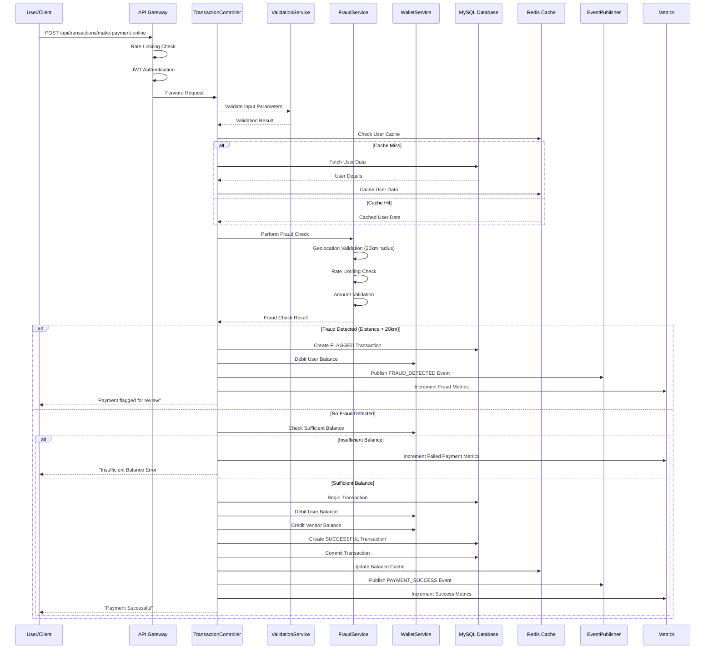
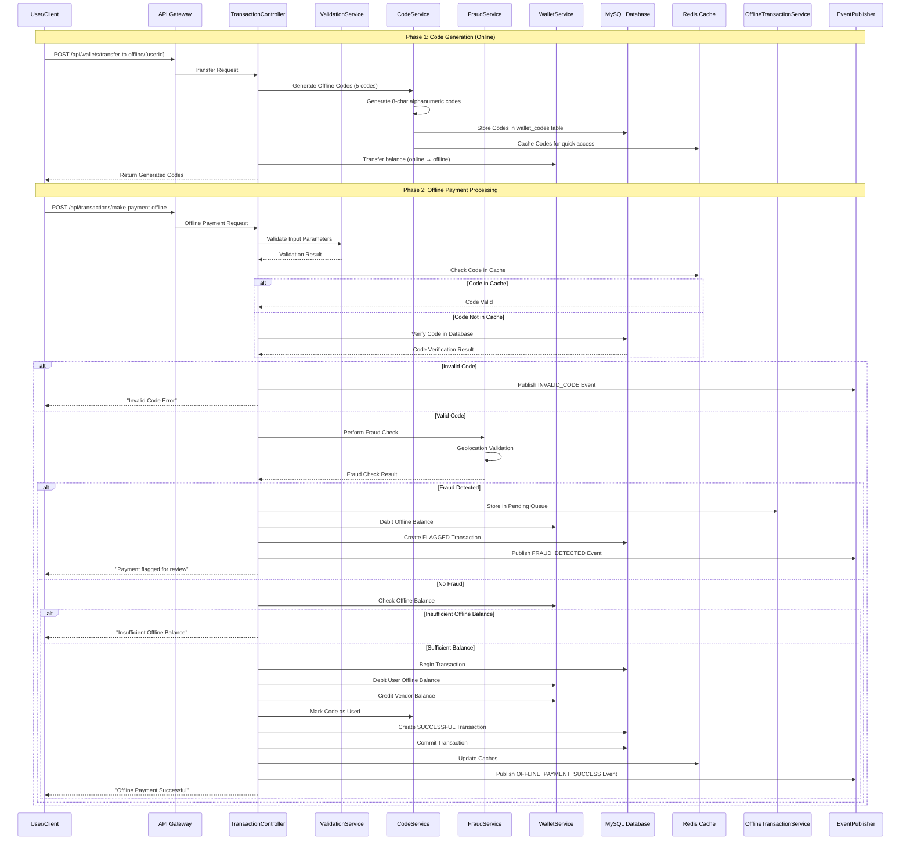
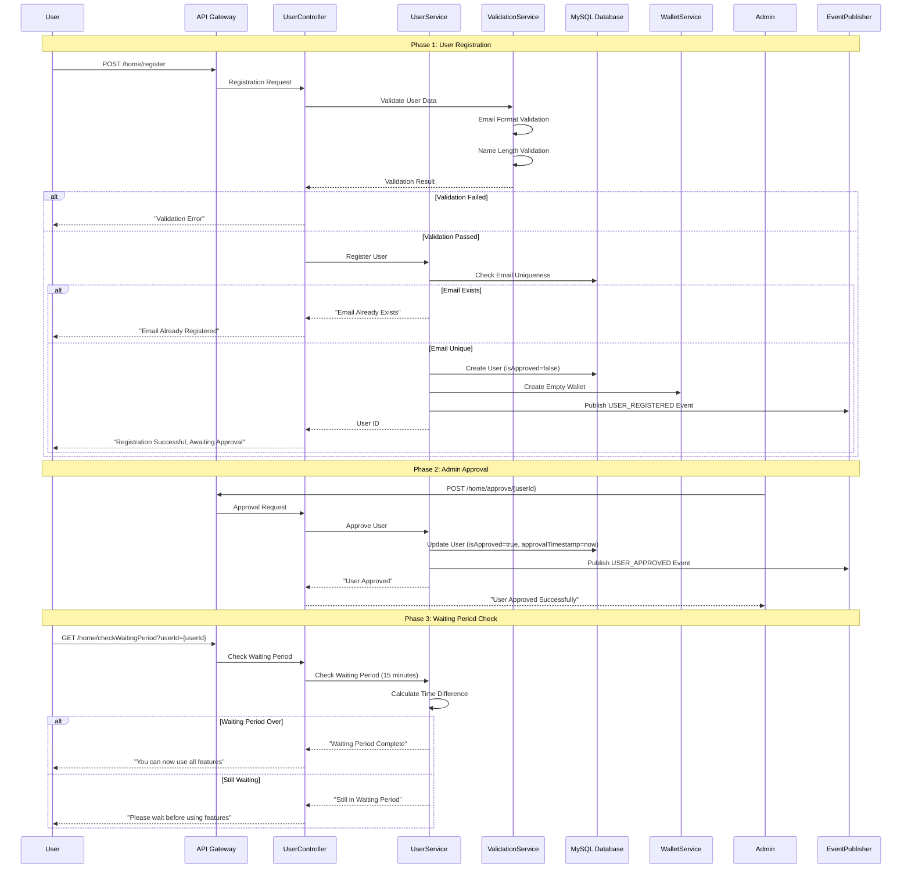
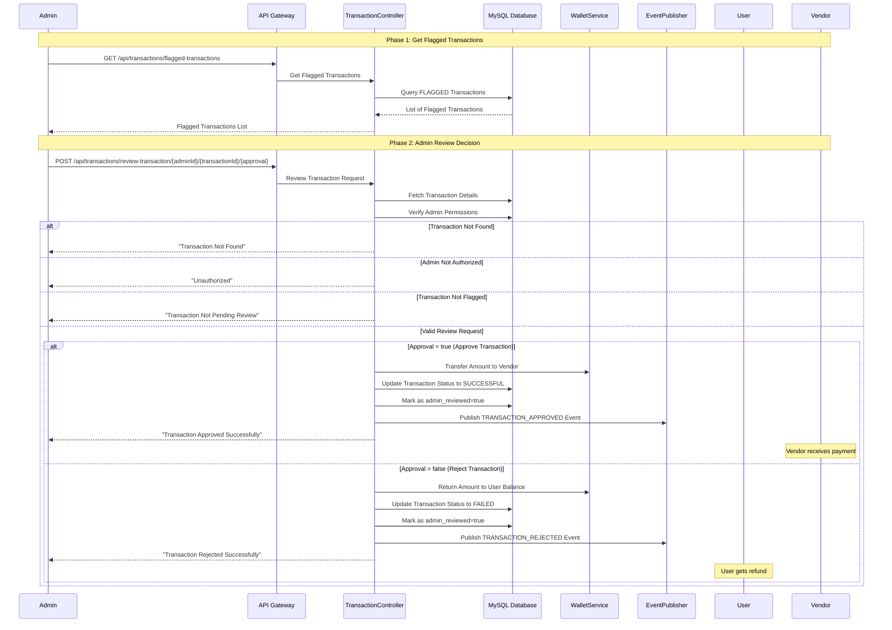
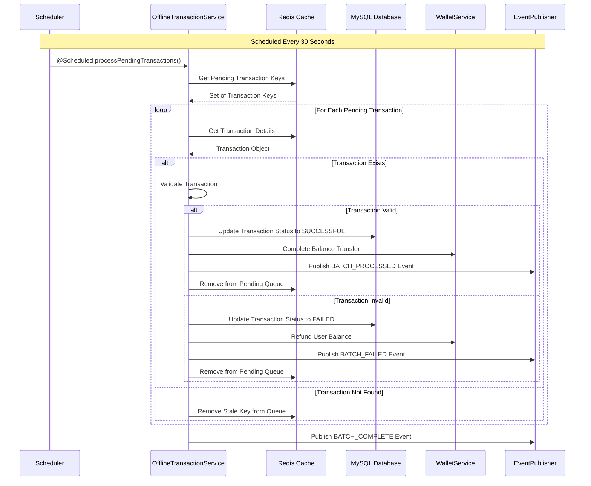
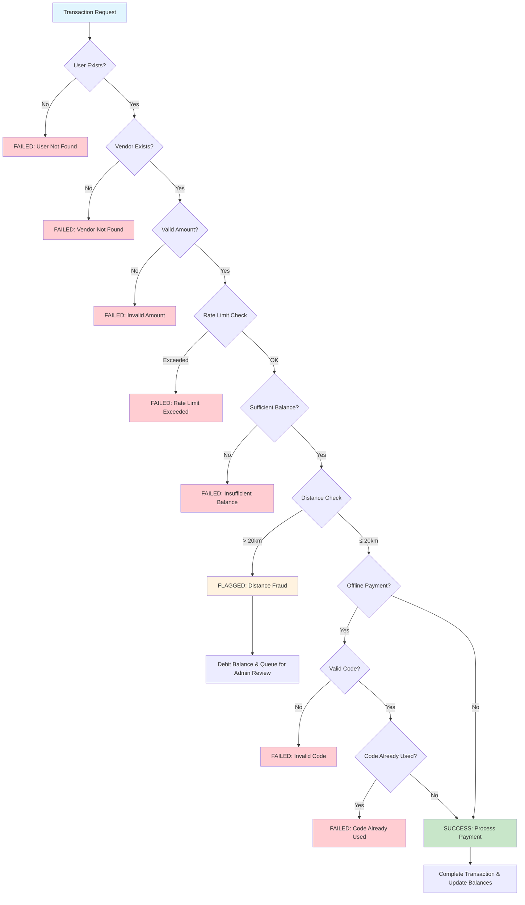
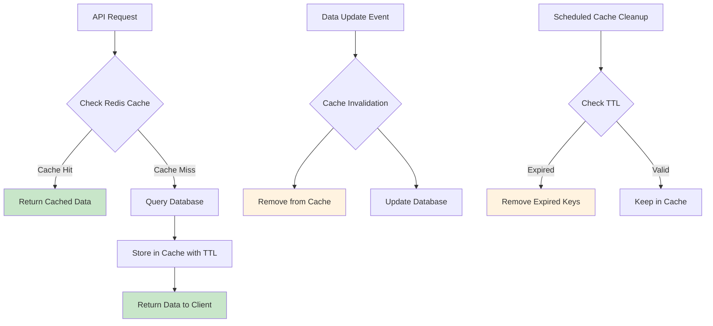
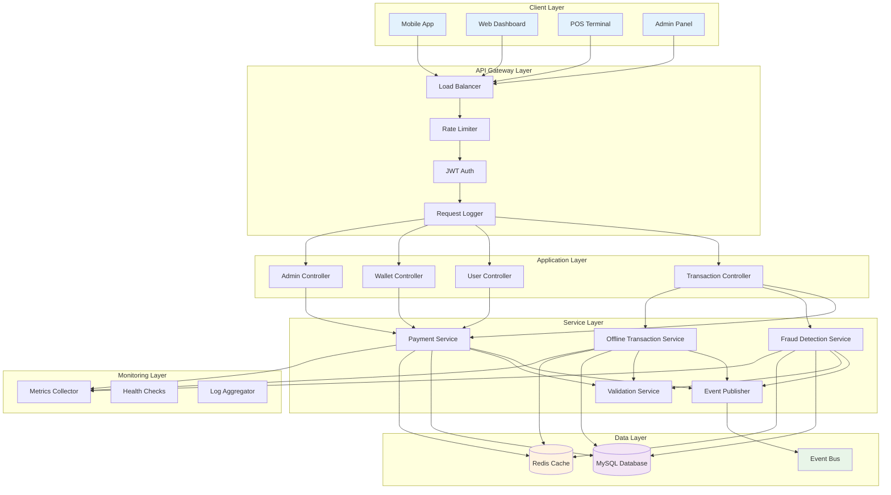

# System Flow Diagrams: Offline-Ready Payment System

## 🔄 Complete Transaction Flows

### 1. **Online Payment Flow**

### 2. **Offline Payment Flow**

### 3. **User Registration & Approval Flow**

### 4. **Admin Transaction Review Flow**

### 5. **Batch Processing Flow (Background)**

### 6. **Fraud Detection Decision Flow**

### 7. **Caching Strategy Flow**

## 📊 System Architecture Overview

These diagrams provide a comprehensive visual understanding of how the Offline-Ready Payment System works, from high-level architecture to detailed transaction flows. Each diagram shows the interaction between different components and the decision-making process at various stages of the system.